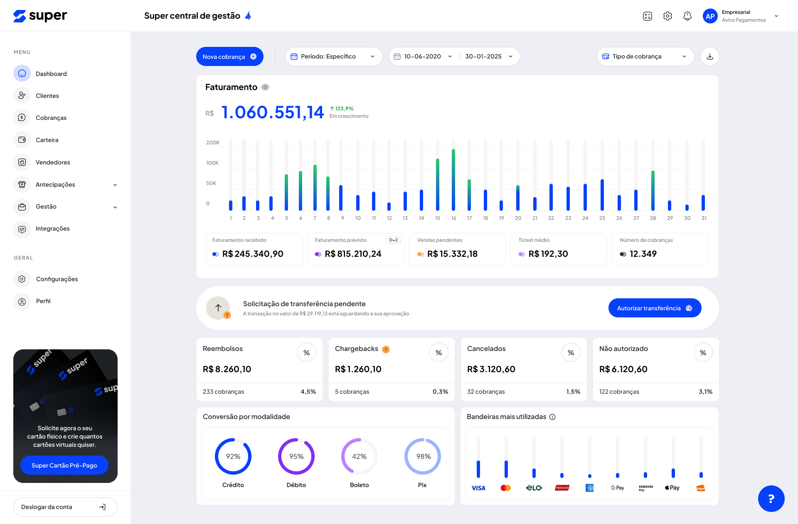

# Super Central de Gestão

**Super Central de Gestão** é um sistema completo para visualização, gerenciamento e análise de dados financeiros.  
Este painel oferece métricas essenciais sobre faturamento, cobranças, modalidades de pagamento e indicadores de performance, tudo em uma interface moderna e intuitiva.

---

## 📊 Visão Geral

A plataforma apresenta um dashboard centralizado onde é possível acompanhar:

- Faturamento total do período
- Crescimento porcentual
- Faturamento recebido vs previsto
- Vendas pendentes
- Ticket médio
- Número de cobranças
- Indicadores de reembolso, chargeback, cancelamentos e transações não autorizadas

O objetivo é permitir decisões rápidas e embasadas através de dados bem organizados.

---

## 🖼️ Layout do Sistema

Abaixo está a interface atual do dashboard (imagem de referência):



---

## 🚀 Funcionalidades Principais

### **1. Dashboard de Faturamento**
- Gráfico mensal interativo
- Comparação entre faturamento recebido e previsto
- Informações detalhadas sobre o desempenho financeiro do período

### **2. Filtros Avançados**
- Seleção de período específico usando calendário
- Filtro por tipo de cobrança
- Botão de “Nova Cobrança” acessível no topo

### **3. Indicadores de Status de Transações**
Cards com:
- Reembolsos  
- Chargebacks  
- Cancelamentos  
- Transações não autorizadas  
Cada indicador exibe: valor total, quantidade de cobranças e porcentagem relacionada ao período.

### **4. Conversão por Modalidade**
Visualização clara da performance por método:
- Crédito  
- Débito  
- Boleto  
- Pix  

Cada modalidade apresenta taxa de conversão destacada.

### **5. Bandeiras Mais Utilizadas**
Gráfico contendo as principais bandeiras de cartão utilizadas pelos clientes:
- Visa  
- Mastercard  
- Elo  
- American Express  
- Hiper  
- Google Pay / Apple Pay / outros

### **6. Solicitação de Transferências**
- Exibição de transferências pendentes
- Botão para autorizar novas transferências

### **7. Navegação Completa**
Menu lateral com:
- Dashboard  
- Clientes  
- Cobranças  
- Carteira  
- Vendedores  
- Antecipações  
- Gestão  
- Integrações  
- Configurações  
- Perfil  

---

## 📦 Instalação e Execução

### **Pré-requisitos**
- Node.js (versão 18 ou superior)
- npm ou yarn

### **Instalação**

1. Clone o repositório:
```bash
git clone <url-do-repositório>
cd super-central/super-central-gestao
```

2. Instale as dependências:
```bash
npm install
```

### **Execução**

Para iniciar o servidor de desenvolvimento:
```bash
npm run dev
```

O projeto estará disponível em `http://localhost:5173`

### **Build para Produção**

Para gerar a build de produção:
```bash
npm run build
```

Para visualizar a build de produção:
```bash
npm run preview
```

---

## 🛠️ Tecnologias Utilizadas

Este projeto foi desenvolvido com as seguintes tecnologias:

### **Frontend**
- **[Vue.js 3](https://vuejs.org/)** - Framework JavaScript progressivo para construção de interfaces
- **[Vite](https://vitejs.dev/)** - Build tool e dev server de alta performance
- **[Tailwind CSS](https://tailwindcss.com/)** - Framework CSS utility-first para estilização
- **[PostCSS](https://postcss.org/)** - Ferramenta para transformar CSS com plugins
- **[Autoprefixer](https://github.com/postcss/autoprefixer)** - Plugin PostCSS para adicionar prefixos de vendor

### **Componentes UI**
- **[Radix Vue](https://www.radix-vue.com/)** - Componentes UI primitivos acessíveis e sem estilo
- **[Lucide Vue Next](https://lucide.dev/)** - Biblioteca de ícones moderna e consistente

### **Gráficos e Visualizações**
- **[ApexCharts](https://apexcharts.com/)** - Biblioteca moderna de gráficos interativos
- **[Vue3-ApexCharts](https://github.com/apexcharts/vue3-apexcharts)** - Wrapper Vue 3 para ApexCharts

### **Utilitários**
- **[clsx](https://github.com/lukeed/clsx)** - Utilitário para construir strings de className condicionalmente
- **[tailwind-merge](https://github.com/dcastil/tailwind-merge)** - Merge de classes Tailwind CSS de forma inteligente
- **[class-variance-authority](https://github.com/joe-bell/cva)** - Utilitário para criar variantes de componentes

### **Fonte**
- **Plus Jakarta Sans** - Tipografia moderna via Google Fonts
